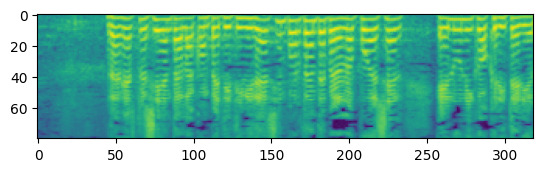
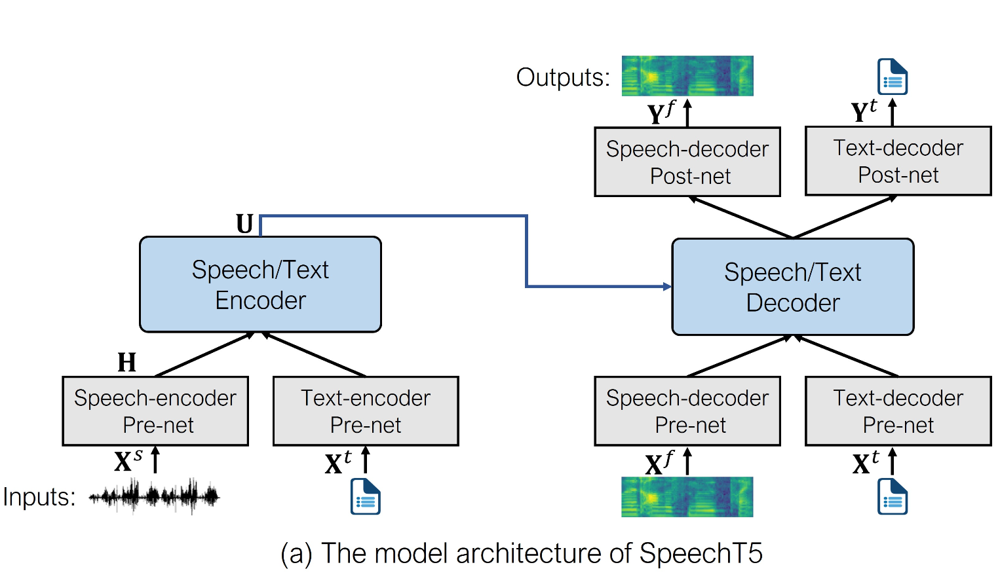
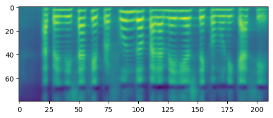

# FinetuneSpeechT5-Spanish
[NYU Steinhardt, Deep Learning for Media Final Project]


[Miya Ding](https://github.com/miyading), [Heqi Qiao](https://github.com/HQQHQ), [Trevor Freed](https://github.com/tfreed357)


This repository hosts the code and resources for fine-tuning a SpeechT5 model for text-to-speech (TTS) tasks using the VoxPopuli dataset. The project leverages the Hugging Face Transformers and Datasets libraries to prepare, process, and train a model capable of generating human-like speech.

## Installation

To run the scripts, you need to install several dependencies. Execute the following commands in your terminal to set up the environment:

```bash
pip3 install transformers datasets soundfile speechbrain==0.5.16 accelerate librosa
pip3 install git+https://github.com/huggingface/transformers.git
```


Or just run the environment file:

```bash
pip install -r envs.txt
```
## Dataset

The project uses the [VoxPopuli](https://huggingface.co/datasets/facebook/voxpopuli) dataset, specifically the Spanish portion. The dataset is preprocessed to normalize audio and text features suitable for training. Especially using the Mel-Spectrogram to train the model:



## Model

The base model is [microsoft/speecht5_tts](https://huggingface.co/docs/transformers/en/model_doc/speecht5), fine-tuned on the processed dataset. A custom data collator handles the batching and padding of training data.



## Training

Training configurations are set up using the Seq2SeqTrainingArguments class from the Transformers library. The model is trained with a focus on using a GPU for acceleration, and the best model is saved based on validation loss.

## Inference

Post-training, the model can generate spectrograms from text:

 

Which are then converted into audible speech using the [HiFi-GAN vocoder model](https://huggingface.co/microsoft/speecht5_hifigan). Example scripts demonstrate how to perform this conversion and how to save the output as a WAV file.

And here are some examples:
1. ["*Deep Learning For Media*" in Spanish:"Aprendizaje profundo para medios de comunicación"](output_examples/output.wav)
2. ["*Music is always the best*" in Spanish:"La música siempre es lo mejor"](output_examples/output1.wav)
3. ["*Early bed, early to rise*" in Spanish:"Pronto a cama, pronto a levantarse"](output_examples/output2.wav)


## Usage

Example usage of the model to generate speech:  

- Remember to use `git lfs pull` to pull the safetensors file for loading the model. (See instructions: https://git-lfs.com)

```python
# Load the processer, pre-trained model and vocoder*
checkpoint = "microsoft/speecht5_tts"
processor = SpeechT5Processor.from_pretrained(checkpoint)

from transformers import SpeechT5ForTextToSpeech
model_dir = "speecht5_finetuned_voxpopuli_nl"
model = SpeechT5ForTextToSpeech.from_pretrained("speecht5_finetuned_voxpopuli_nl")
from transformers import (
    SpeechT5ForTextToSpeech,
    SpeechT5HifiGan,
    SpeechT5FeatureExtractor,
    SpeechT5Processor,
)

vocoder = SpeechT5HifiGan.from_pretrained(
        "microsoft/speecht5_hifigan", torch_dtype=torch.float
    )

# Load one speaker embeddings
speaker_embeddings = torch.load("SpeakerMan2.pt")

# Prepare input text and generate spectrogram
input_text = "Aprendizaje profundo para medios de comunicación"
inputs = processor(text=input_text, return_tensors="pt")
spectrogram = model.generate_speech(inputs["input_ids"], speaker_embeddings)

# Convert spectrogram to audio and play it
with torch.no_grad():
    speech = vocoder(spectrogram)

from IPython.display import Audio
Audio(speech.numpy(), rate=16000)
```
- Or you can just run the [***Play_and_Evaluate.ipynb***](Play_and_Evaluate.ipynb) file to try the model and see its performance!
- There are 3 man speakers and 3 woman speakers for you to choose.


## Reference

[Text to Speech](https://huggingface.co/docs/transformers/en/tasks/text-to-speech) on [huggingface.co](huggingface.co).
